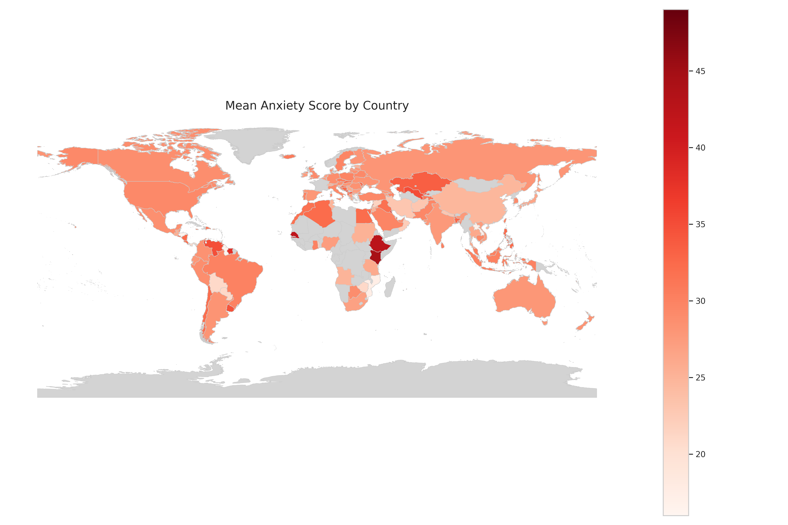

voici donc ce que j'ai mtn analyse ce readme comme les autres doc:# Mental Health & Anxiety – DASS-21 Analysis & Modelling


This project analyses patterns of self-reported anxiety using the open-access DASS-21 survey from Open Psychometrics (~39,000 respondents worldwide). It implements a fully reproducible Python pipeline that:

- cleans and standardises the raw survey data,
- produces descriptive statistics and visualisations,
- fits and compares three regression models (Linear Regression, Random Forest, Gradient Boosting) to predict anxiety scores,
- exports all figures and tables used in the technical report.

The goal is to understand how anxiety relates to demographics, personality traits (TIPI), and co-occurring symptoms (stress, depression), while being explicit about sampling and non-response bias.

## Main Features

- Clean, **modular** Python codebase (`src/` package) following best practices.
- End-to-end pipeline runnable with a **single command**.
- Automated visualisations:
  - histograms and boxplots (overall distribution, gender, age, TIPI traits, etc.),
  - geographic plots (world map by country, barplot by continent),
  - regression coefficient forest plots,
  - Random-Forest feature-importance barplot.
- Export of statistical tables in **CSV**, **PDF** and **LaTeX** formats.
- Three **regression** models for continuous anxiety scores:
  - **Linear Regression** (baseline),
  - **Random Forest** with inverse-frequency gender weights,
  - **Gradient Boosting Regressor**;
  all using the same set of predictors:
  - psychological variables (DASS Stress/Depression, TIPI traits),
  - demographic variables (gender, age group, education, urbanicity, etc.).
- Small but focused **pytest** test suite for key components.


## Setup & Installation

### Prerequisites

- Python 3.10 or later
- Recommended: use a virtual environment (`venv` or `conda`)

### Installation

```bash
git clone https://github.com/vrelvape/mental-health-anxiety-dass21.git
cd mental-health-anxiety-dass21
pip install -r requirements.txt
```
The environment can be recreated using pip install -r requirements.txt inside a virtual environment.

## Input data files

### 1. Main survey CSV

The main survey dataset used in this project is stored as:

- `data/mental_health_survey.csv`

If you are working from a fresh clone and this file is missing (for example, if the raw data was removed for privacy or size reasons), you can download it again from Open Psychometrics:

> Open Psychometrics – DASS-21 dataset  
> https://openpsychometrics.org/_rawdata/

The original file from Open Psychometrics is typically named `data.csv`. 

If needed, please rename it to `mental_health_survey.csv` and place it in the `data/` directory so that the pipeline can find it.


### 2. World boundaries GeoJSON (for the map figure)

One figure in this project, the choropleth “Mean Anxiety Score by Country” requires a GeoJSON file containing country boundaries.

To enable this figure, download a world countries GeoJSON file and save it as:

- `data/geo/world_countries.geojson`

For example, from the project root you can create the folder and download a compatible file with:

```bash
mkdir -p data/geo

curl -L "https://raw.githubusercontent.com/datasets/geo-countries/master/data/countries.geojson" \
  -o data/geo/world_countries.geojson
```

## How to Run the Full Pipeline

From the project root:
### **Option 1 — Standard execution (recommended)**

```bash
python main.py

```
### **Option 2 - Module execution**
```bash
python -m src.main

```

These two commands will:
- Load and clean the dataset
- Generate summary statistics and visualizations
- Export all tables to `results/tables/` and all figures to `results/figures/`

## Testing

This project includes a small but focused test suite to ensure that the core components
of the pipeline behave as expected.

From the project root, you can run all tests with:

```bash
pytest
```
To run the tests with coverage and see which parts of the code are exercised, use:
```bash
pytest --cov=src --cov-report=term-missing
```
These commands will:
- Execute unit tests for data cleaning, feature engineering and modelling components
- Report any failures or regressions in the pipeline
- (With `--cov`): show line-by-line coverage information for the `src/` package

## Reproducing the LaTex Report

From the `docs/`folder:

```bash
cd docs
pdflatex Mental_Health_Anxiety_Report.tex
biber Mental_Health_Anxiety_Report
pdflatex Mental_Health_Anxiety_Report.tex
pdflatex Mental_Health_Anxiety_Report.tex
```

## Repository Structure

```
mental-health-anxiety-dass21/
├── data/
│   └── mental_health_survey.csv        # Raw input data (DASS-21)
│
├── docs/                     
│   └── figures/                      
│   └── tables/
│   ├── Mental_Health_Anxiety_Report.tex   # LaTeX source for the report
│   └── Mental_Health_Anxiety_Report.pdf   # Final technical report (compiled locally)
│
├── results/
│   ├── figures/                       # All generated figures (PNG)
│   └── tables/                        # Exported tables
│       ├── csv/
│       ├── pdf/
│       └── latex/
│
├── src/
│   ├── analysis/                      # Statistical analysis modules
│   │   ├── anova_demographics.py
│   │   ├── anova_personality.py
│   │   ├── descriptive.py
│   │   ├── ml_models.py
│   │   ├── nonresponse.py
│   │   └── regressions.py
│   │
│   ├── viz/                           # Visualisation modules
│   │   ├── anxiety_distribution.py
│   │   ├── coef_forest_plots.py
│   │   ├── demographic_boxplots.py
│   │   ├── geo_anxiety_plots.py
│   │   ├── ml_feature_importance.py
│   │   └── tipi_boxplots.py
│   │
│   ├── cleaning.py                    # Data cleaning and harmonisation
│   ├── config.py                      # Paths, constants and settings
│   ├── data_loading.py                # Raw-data loader
│   ├── export_core_tables.py          # Table export logic
│   ├── features.py                    # Feature engineering helpers
│   └── main.py                        # Pipeline entry point (python -m src.main)
│
├── tests/                             # Pytest test suite
│   └── test_*.py
│
├── AI_USAGE.md                        # Detailed disclosure of AI usage
├── PROPOSAL.md                        # Original project proposal
├── README.md                          # (this file)
├── requirements.txt                   # Python dependencies
└── .gitignore
```

## Outputs

### Statistical Tables

- Mean anxiety by country
- Mean anxiety by continent
- Anxiety severity by age group, gender, and TIPI traits
- Top 10 countries by anxiety level and participant count
- Model comparison table (Linear Regression vs Random Forest vs Gradient Boosting: R² and RMSE)
- ANOVA summaries for:
  - demographic predictors,
  - TIPI personality traits.
Tables are saved under:
- `results/tables/csv/`
- `results/tables/pdf/`
- `results/tables/latex/`

### Visualizations

- Histograms (overall distribution)
- Boxplots (by gender, continent, etc.)
- Barplots (mean anxiety scores)
- Choropleth world map (mean anxiety by country)

All outputs are generated programmatically and stored in `results/figures/` and `results/tables/`.




This map shows the average anxiety levels across countries.

## Version control & commit policy

The project was developed primarily in GitHub Codespaces, with most of the
work (data cleaning, refactoring of the pipeline, modelling and report-aligned
visualisations) being done interactively in a single environment.

Because the structure of the project was revised multiple times, using a very
fine-grained commit strategy would have produced a large number of noisy,
intermediate commits. Instead, the development workflow followed this logic:

- iterate and stabilise the main components directly in Codespaces,
- then publish the final version to the GitHub repository using a series of
  meaningful commits (at least 20, as requested in the project rules),
  corresponding to major milestones (data loading/cleaning, analyses,
  visualisations, modelling, documentation).

As a consequence, the commits in the final repository are relatively close in
time, and there are few commits whose sole purpose is to “fix a small bug”
immediately after the previous one. This is expected given the workflow above:
the actual development started on **5 November 2025** and took place almost
entirely in Codespaces before being pushed to GitHub in its final, structured
form.

## Known Limitations

This project is based on an online convenience sample from Open Psychometrics and is **not representative** of the global population. Some groups and regions are heavily over-represented (e.g., certain countries, women), while others have very small sample sizes.

All measures are **self-reported** and collected at a single time point, which means the analysis is correlational only and cannot establish causality. The DASS-21 subscales (stress, depression, anxiety) are also conceptually overlapping, so models that use all three should be interpreted with care.

Finally, the machine learning models are designed for **exploratory analysis**, not for clinical use or individual diagnosis. Their role is to highlight patterns and relative predictor importance, not to provide medical recommendations.

## Data Source

The dataset used in this project comes from:

> Open Psychometrics – DASS-21 dataset  
> https://openpsychometrics.org/_rawdata/

(See the technical report and `references.bib` for the full citation.)

## AI Disclosure

A detailed description of how AI tools were used during development is provided in [`AI_USAGE.md`](AI_USAGE.md). All final modelling decisions, code integration and interpretation of results were reviewed and validated by the student.

## License & Academic Use

This project is intended for **academic and educational purposes** only.  
Please cite the dataset source and this repository if you reuse parts of the pipeline.


## Author

Created by **Victor Aguiar Relva Pereira** for the *Data Science and Advanced Programming* course (HEC Lausanne, 2025–2026).  
All scripts and analysis choices were made and reviewed by the student.